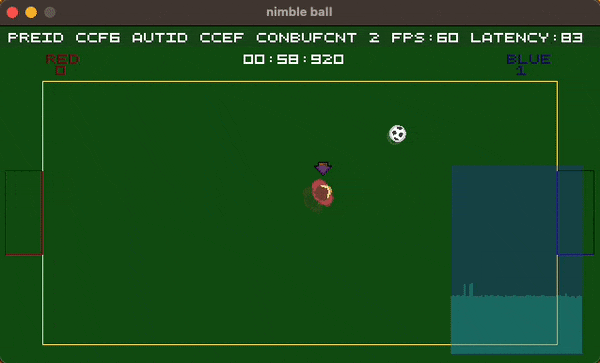

# Nimble Ball

Example game for the Nimble Network Engine.

Uses:

* [Nimble Ball Presentation](https://github.com/piot/nimble-ball-presentation)
  * [Sdl Render](https://github.com/piot/sdl-render)
* [Nimble Ball Simulation](https://github.com/piot/nimble-ball-simulation)

## Requirements

Nimble Ball is using SdlRender for presentation, check out [Sdl Render](https://github.com/piot/sdl-render/#requirements) for list of requirements.

## Build

* Make sure [cmake](https://cmake.org/download/) is installed.
> :warning: Do not use cmake `3.26.x`, since it is broken. Recommended to use `3.17.x` - `3.25.x`
* Make sure [Go](https://go.dev/doc/install) is installed.
* while in the nimble ball root directory, run:

```console
 go run github.com/piot/deps/src/deps@main fetch
```

This will download all dependencies and put in `deps/` directory. It should look similar to


* Cd into the source directory

```console
cd src
```

* Create cmake cache

```console
 cmake .
```

(use `cmake -DCMAKE_BUILD_TYPE=Debug .` for debug version)

* Build

```console
cmake --build .
```

* Run Nimble Ball

```console
./lib/nimble_ball
```

* Use Keyboard `W`,`A`,`S`,`D`. Use `SPACE` for primary ability (and confirm selection in menu). Use `LEFT SHIFT` for secondary ability. Press `§` (key just left to `1`) to quit immediately.

* Select `Host LAN` and then optionally `Join LAN` on another client. Note only one host and client is supported in this version. No support for connection disconnect yet, so disconnected avatars will remain on the level. `Host Online` and `Join Online` is under development, and is not working right now.

* Gameplay: Hold `SPACE` to build up power to shoot. Release `SPACE` to shoot. press `LEFT SHIFT` to do a slide tackle.

The 'half transparent shadow' you see on the avatars, shows the authoritative state. To make it easy to see the difference between authoritative and predicted state.

## Nimble Ball

* Lagometer and network warning icons


